# GreenCart 🥬🛒

A fresh produce shopping app built with Flutter, Firebase Authentication, and Riverpod state management.

## Screenshots

| Splash | Onboarding | Login | Signup |
|:------:|:----------:|:-----:|:------:|
| 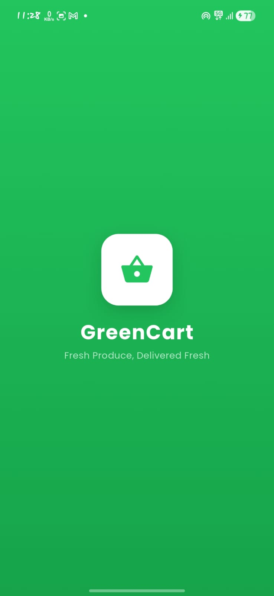 | 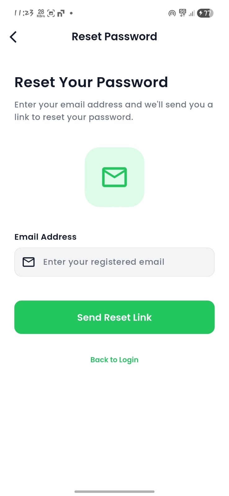 | 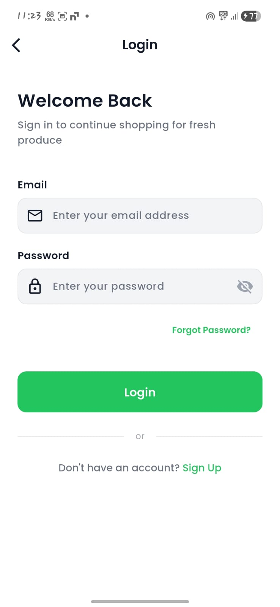 | 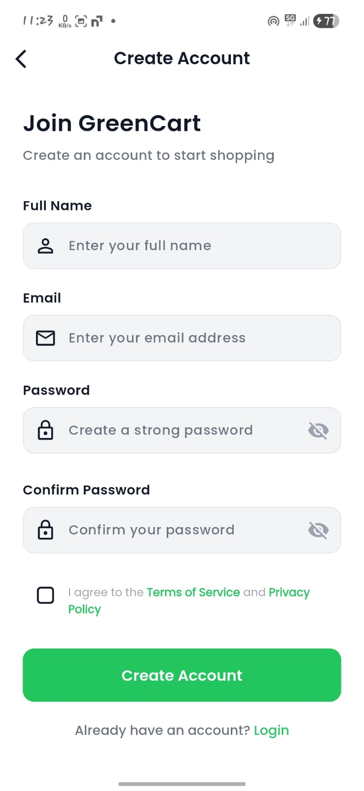 |

| Home | Search | Product Detail | Cart |
|:----:|:------:|:--------------:|:----:|
| 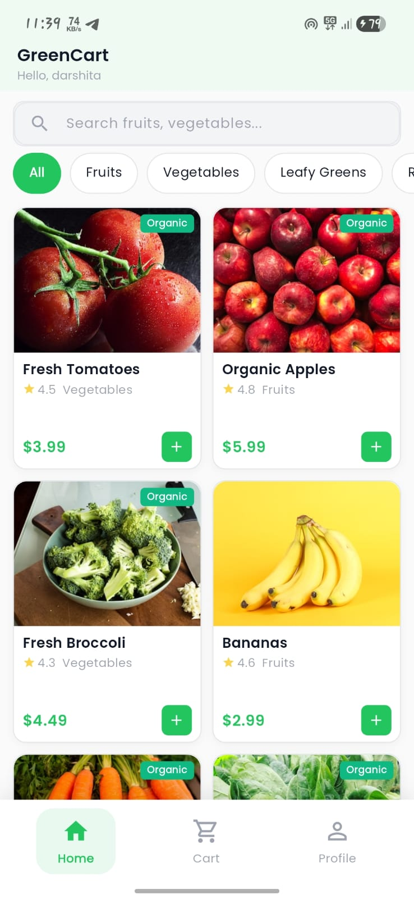 | 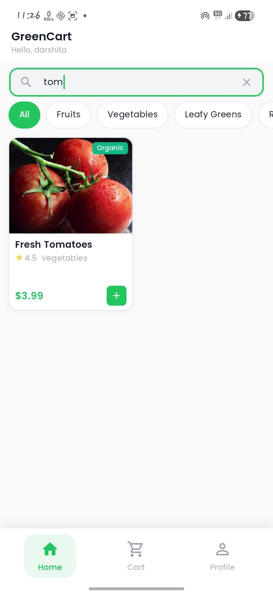 | 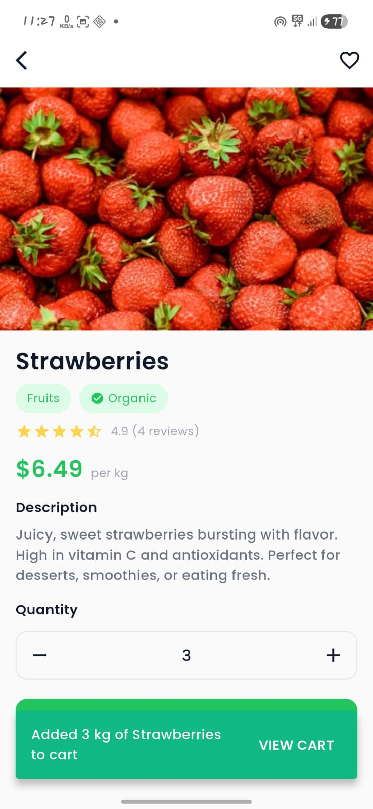 | 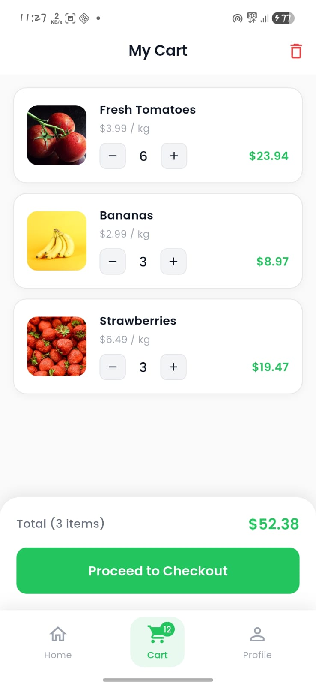 |

| Profile | Categories | Checkout |
|:-------:|:----------:|:--------:|
| 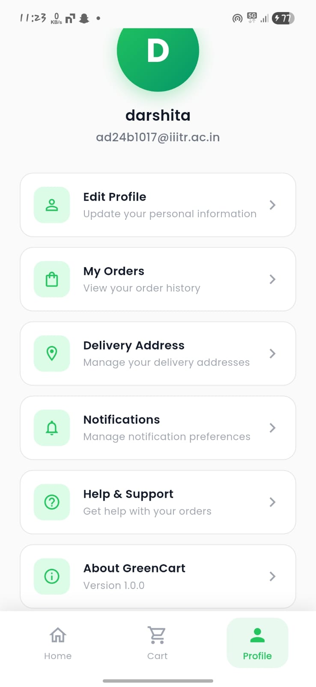 | 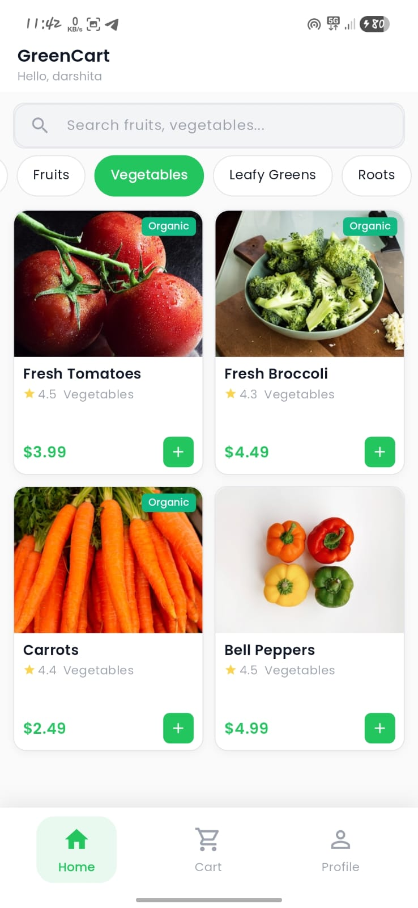 | 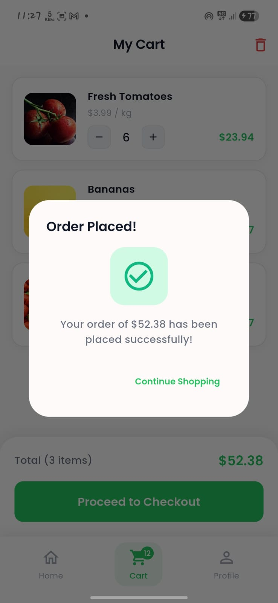 |

## Features

- **Splash Screen** – Animated splash with auto-login detection
- **Onboarding** – 3-page swipeable onboarding for first-time users
- **Authentication** – Login, Sign-up, and Forgot Password via Firebase Auth
- **Home Page** – Browse fruits, vegetables, leafy greens, roots, and exotic produce
- **Search** – Real-time search across all products
- **Category Filter** – Filter products by category
- **Product Details** – Full product view with image, rating, description, quantity picker
- **Shopping Cart** – Add/remove items, update quantities, checkout flow
- **Profile** – User profile with settings and logout
- **Bottom Navigation** – Home, Cart (with badge count), and Profile tabs

## Tech Stack

| Layer | Technology |
|-------|-----------|
| Framework | Flutter |
| State Management | Riverpod (flutter_riverpod) |
| Authentication | Firebase Auth |
| Database | Local JSON (assets/data/products.json) |
| Routing | Named routes with onGenerateRoute |
| Fonts | Google Fonts (Poppins) |
| Architecture | Clean Architecture |

## Architecture

```
lib/
├── main.dart
├── app.dart
├── firebase_options.dart
│
├── config/
│   ├── constants/
│   ├── routes/
│   └── theme/
│
├── models/
│   ├── product.dart
│   ├── user.dart
│   ├── cart_item.dart
│   └── validators.dart
│
├── providers/
│   ├── auth_provider.dart
│   ├── product_provider.dart
│   └── cart_provider.dart
│
├── services/
│   ├── auth_service.dart
│   └── product_service.dart
│
├── screens/
│   ├── splash_screen.dart
│   ├── onboarding_screen.dart
│   ├── login_screen.dart
│   ├── signup_screen.dart
│   ├── forgot_password_screen.dart
│   ├── main_navigation_screen.dart
│   ├── home_screen.dart
│   ├── product_detail_screen.dart
│   ├── cart_screen.dart
│   └── profile_screen.dart
│
└── widgets/
    ├── custom_button.dart
    ├── custom_text_field.dart
    ├── product_card.dart
    ├── product_grid.dart
    └── product_search_bar.dart
```

## State Management (Riverpod)

| Provider | Type | Purpose |
|----------|------|---------|
| `authStateProvider` | StreamProvider | Firebase auth state |
| `loginProvider` | StateNotifier | Login form + async state |
| `signupProvider` | StateNotifier | Signup form + async state |
| `allProductsProvider` | FutureProvider | Load products from JSON |
| `productsByCategoryProvider` | Provider | Category filtering |
| `searchResultsProvider` | Provider | Search filtering |
| `cartProvider` | StateNotifier | Cart CRUD operations |
| `cartItemCountProvider` | Provider | Derived item count |
| `cartTotalProvider` | Provider | Derived total price |

## Responsive Design

- Product grid adapts columns (2 → 3 → 4) based on screen width
- Product detail image scales with screen height
- All layouts use `MediaQuery` for responsive sizing

## Setup

1. Clone the repo
2. Run `flutter pub get`
3. Set up Firebase project and update `firebase_options.dart`
4. Enable Email/Password auth in Firebase Console
5. Run `flutter run`
